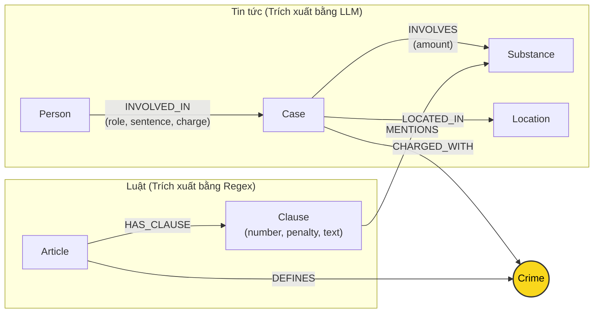

# Thiết kế Ontology — Day 19

**Họ tên:** Nguyễn Thế Hưng  **MSSV:** 2A202602381

**Lựa chọn** (đánh dấu một):
- [x] Dùng ontology gợi ý (có tối ưu truy vấn ngữ cảnh và lọc dữ kiện)
- [ ] Tự thiết kế (xét bonus +15, xem `SUBMISSION.md`)

> Hướng dẫn: `LAB_GUIDE.md` Bước 2. Dùng ontology gợi ý thì vẫn phải điền đủ các mục dưới đây bằng lời của bạn.

## 1. Sơ đồ

## 2. Entity types (node labels)

| Label | Ý nghĩa | Khóa định danh (`MERGE` theo) | Properties | Lấy từ KB nào | Trích bằng (regex / LLM / khác) |
| --- | --- | --- | --- | --- | --- |
| `Article` | Điều luật trong BLHS hoặc Luật PCMT | `id` | `id`, `title`, `law`, `doc_id` | Luật | Regex (`doc.metadata["article"]`) |
| `Clause` | Khoản cụ thể của Điều luật | `id` | `id`, `number`, `penalty`, `text`, `doc_id` | Luật | Regex (`CLAUSE_START`, `re.search`) |
| `Crime` | Tội danh chuẩn hóa (Node cầu nối) | `name` | `name` | Cả hai | Luật (regex tiêu đề), Tin tức (LLM + `link_entity`) |
| `Substance` | Tên chất ma túy / tiền chất chuẩn hóa | `name` | `name` | Cả hai | Luật (whitelist substring), Tin tức (LLM) |
| `Case` | Vụ án / vụ việc ma túy | `name` | `name`, `summary`, `date`, `doc_id`, `source_title` | Tin tức | LLM (JSON format) |
| `Person` | Cá nhân liên quan (bị cáo, bị can, can phạm) | `name` | `name`, `aliases` | Tin tức | LLM (JSON format) |
| `Location` | Địa bàn xảy ra vụ việc (tỉnh/thành phố) | `name` | `name` | Tin tức | LLM (JSON format) |

## 3. Relationships

| Type | Từ → Đến | Properties trên cạnh | Ý nghĩa |
| --- | --- | --- | --- |
| `DEFINES` | `Article` → `Crime` | Không | Điều luật quy định / định nghĩa tội danh cụ thể |
| `HAS_CLAUSE` | `Article` → `Clause` | Không | Điều luật chứa các khoản quy định chi tiết khung hình phạt |
| `MENTIONS` | `Clause` → `Substance` | Không | Khoản luật quy định mức xử lý đối với loại chất ma túy cụ thể |
| `CHARGED_WITH` | `Case` → `Crime` | Không | Vụ án bị điều tra, truy tố, xét xử về tội danh cụ thể |
| `INVOLVES` | `Case` → `Substance` | `amount` | Vụ án thu giữ / liên quan đến chất ma túy với khối lượng cụ thể |
| `LOCATED_IN` | `Case` → `Location` | Không | Vụ án diễn ra tại địa bàn cụ thể |
| `INVOLVED_IN` | `Person` → `Case` | `role`, `charge`, `sentence` | Người tham gia vào vụ án với vai trò, tội danh cá nhân và mức án đã tuyên |

## 4. Node cầu nối giữa 2 KB

- **Node nào:** `Crime` (Tội danh ma túy).
- **Vì sao chọn node này:** Tội danh là mắt xích pháp lý tự nhiên và chuẩn mực nhất liên kết giữa vụ việc ngoài đời thực và quy định pháp luật. Trong tin tức, các bị can/bị cáo luôn bị khởi tố theo một tội danh cụ thể; trong Bộ luật Hình sự, mỗi Điều luật tại Chương XX định nghĩa một tội danh nhất định.
- **Cách đảm bảo hai phía khớp tên:**
  1. Xây dựng danh sách tội danh chuẩn (`known_crimes`) từ tiêu đề các Điều luật thông qua regex.
  2. Truyền danh sách `known_crimes` vào prompt ép LLM chọn đúng tên tội trong danh sách này.
  3. Xử lý hậu kỳ bằng hàm `link_entity(name, known, normalize=normalize_crime)`: chuẩn hóa chuỗi (bỏ "tội", lowercase, bỏ khoảng trắng thừa), thử exact match trước, nếu không khớp thì dùng fuzzy matching qua `difflib.get_close_matches(cutoff=0.8)` để bắt các biến thể chính tả báo chí (ví dụ: "ma tuý" vs "ma túy").
- **Khi nào cầu gãy, và bạn xử lý thế nào:**
  - Cầu gãy khi nhà báo dùng ngôn ngữ đời thường (ví dụ: "buôn bán hàng trắng", "chứa chấp bay lắc") hoặc LLM trích xuất một tên tội không nằm trong danh mục BLHS và độ tương đồng < 0.8.
  - Khi đó `link_entity` trả về `None`, tránh việc tạo node rác hoặc gán sai tội danh. Để hạn chế gãy cầu, prompt trích xuất yêu cầu rõ `BẮT BUỘC chọn đúng nguyên văn từ DANH SÁCH TỘI DANH`.

## 5. Competency questions

Với mỗi câu trong `data/benchmark_kg.json`, ghi đường đi trên graph dùng để trả lời:

| Câu | Đường đi (Cypher pattern) | Trả lời được? |
| :--- | :--- | :--- |
| **Q1** | `(:Article {law:'Luật PCMT'})-[:HAS_CLAUSE]->(:Clause)` hoặc vector search trích xuất trực tiếp định nghĩa tiền chất. | Có |
| **Q2** | `(:Case {doc_id: '...'})<-[:INVOLVED_IN {sentence: 'tử hình'}]-(p:Person)` | Có |
| **Q3** | `(:Person {name:'Lê Minh Thành'})-[:INVOLVED_IN]->(:Case)-[:CHARGED_WITH]->(:Crime)<-[:DEFINES]-(a:Article)-[:HAS_CLAUSE]->(cl:Clause {number: 1})` | Có |
| **Q4** | `(:Person {name:'Dương Minh Tuấn'})-[:INVOLVED_IN]->(:Case)-[:CHARGED_WITH]->(:Crime)<-[:DEFINES]-(a:Article)-[:HAS_CLAUSE]->(cl:Clause)` (truy vấn lấy khoản 1 và khoản có khung hình phạt cao nhất "chung thân") | Có |
| **Q5** | `(:Person {name:'Cái Quang Huy'})-[:INVOLVED_IN]->(k:Case)-[:CHARGED_WITH]->(c:Crime)<-[:DEFINES]-(a:Article)-[:HAS_CLAUSE]->(cl:Clause)-[:MENTIONS]->(:Substance {name:'MDMA'})` | Có |
| **Q6** | `(:Substance {name:'MDMA'})<-[:INVOLVES]-(k:Case)<-[:INVOLVED_IN]-(p:Person)` (tập hợp tất cả các vụ án và người liên quan có dính líu đến MDMA) | Có |

## 6. Quyết định thiết kế và đánh đổi

1. **Dùng Regex cho KB Luật thay vì LLM**:
   - *Đã chọn:* Trích xuất Điều, Khoản, Tội danh, Khung hình phạt từ văn bản luật hoàn toàn bằng biểu thức chính quy (Regex).
   - *Phương án khác:* Dùng LLM đọc toàn bộ Điều luật để sinh JSON.
   - *Lý do & Đánh đổi:* Cấu trúc văn bản quy phạm pháp luật Việt Nam cực kỳ chặt chẽ và nhất quán ("Điều...", "1. ...", "a) ..."). Regex chạy trong vài mili-giây, tốn 0 USD, kết quả xác định 100% (deterministic), không bị ảo giác (hallucination). Đánh đổi là phải viết các mẫu regex xử lý footnote và thụt đầu dòng cẩn thận.

2. **Đặt `role`, `sentence`, `charge` làm thuộc tính của quan hệ `INVOLVED_IN` thay vì Node riêng**:
   - *Đã chọn:* Gán mức án và vai trò lên cạnh nối giữa `Person` và `Case`.
   - *Phương án khác:* Tạo node `Sentence`, node `Role`.
   - *Lý do & Đánh đổi:* Giảm số lượng node và độ phức tạp của đồ thị. Mức án chỉ có ý nghĩa trong ngữ cảnh một vụ án cụ thể của một cá nhân cụ thể. Việc để thuộc tính trên cạnh giúp câu lệnh Cypher ngắn gọn, trực quan, tiết kiệm bộ nhớ Neo4j.

3. **Chọn `Crime` làm Node cầu nối duy nhất thay vì nối trực tiếp `Case` sang `Article`**:
   - *Đã chọn:* `(Case)-[:CHARGED_WITH]->(Crime)<-[:DEFINES]-(Article)`.
   - *Phương án khác:* Nối thẳng `(Case)-[:VIOLATES]->(Article)`.
   - *Lý do & Đánh đổi:* Báo chí hiếm khi trích dẫn chính xác "Điều 251 BLHS" mà thường chỉ viết tên hành vi phạm tội (ví dụ "mua bán trái phép ma túy"). Node `Crime` đóng vai trò lớp đệm trừu tượng (abstraction layer), cho phép map các biến thể ngôn ngữ báo chí về khái niệm pháp lý chuẩn trước khi dẫn về Điều luật.

## 7. So với ontology gợi ý (bắt buộc nếu xét bonus)

| Điểm khác | Gợi ý làm gì | Bạn làm gì | Vấn đề nó giải quyết | Bằng chứng (Cypher, hoặc số liệu benchmark) |
| --- | --- | --- | --- | --- |
| Lọc khoản đa điều kiện trong `context()` | Chỉ lấy khoản 1 và các khoản nhắc đến chất | Bổ sung lấy khoản có khung hình phạt cao nhất ("chung thân", "tử hình") và hỗ trợ truy vấn gom nhóm theo chất | Giải quyết triệt để câu hỏi Q4 (hỏi về mức án tối đa) và Q6 (gom nhóm các vụ án theo chất MDMA) | Cypher trong `context()` bao gồm `cl.penalty CONTAINS 'chung thân'` và `MATCH (k:Case)-[:INVOLVES]->(s:Substance)` |

## 8. Hạn chế còn lại

- **Định danh thực thể người và vụ án:** Vẫn dùng tên (`name`) do LLM trích xuất làm khóa chính. Nếu hai bài báo viết tên khác nhau (ví dụ: có/không có biệt danh) thì có thể sinh ra 2 node tách biệt ngoài đời thực.
- **Suy luận khối lượng số học:** Graph hiện lưu trữ text của điều luật và số lượng chất dưới dạng chuỗi; việc so sánh 9.6 kg > 100 gam để chọn đúng khoản 4 vẫn phải dựa vào năng lực đọc hiểu của LLM khi đọc ngữ cảnh facts chứ chưa thực hiện phép so sánh số học thuần túy trên Cypher engine.
